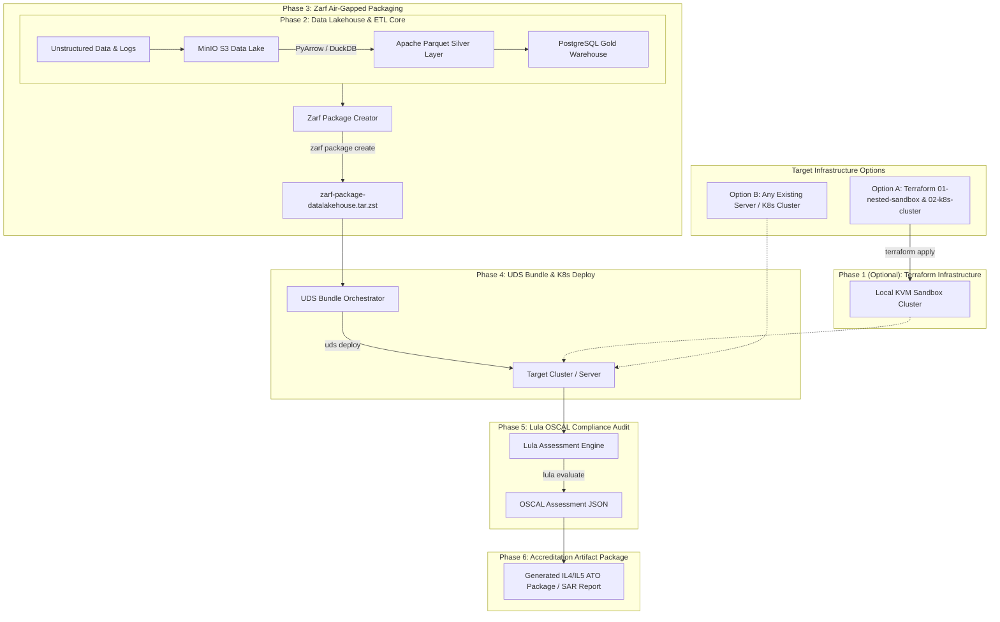

# Master Execution Plan: Air-Gapped IL4/IL5 Data Lakehouse (Zarf + UDS + Lula)

This document outlines the **6-Phase Implementation Plan** for building, deploying, and auditing an air-gapped Data Lakehouse and automated IL4/IL5 accreditation engine.

> 💡 **Infrastructure Agnostic Design:** Phase 1 (Terraform Provisioning) is **optional**. Anyone with an existing server or Kubernetes cluster (K3s, RKE2, EKS, KinD, bare-metal) can skip Phase 1 and deploy directly starting at Phase 2/3.

> ⚠️ **Verification Gate Requirement:** After completing each phase, you MUST execute the **Gate Verification Commands** and confirm green status before advancing to the next phase.

---

## 📅 Phase Summary Roadmap



---

## 🚩 Phase 1 (Optional): Infrastructure Provisioning via Terraform (`libvirt` / KVM)

### Objective
Automate the deployment of a Layer 1 **Nested Hypervisor Sandbox VM** (`datalakehouse-sandbox-node`) on `192.168.9.110` with `/dev/kvm` host-passthrough, deterministic ED25519 SSH host keys, and Stage 2 cluster nodes running inside it.

*(Skip Phase 1 if deploying to an existing server or Kubernetes cluster).*

### Tasks
- [ ] Configure Stage 1: `terraform/environments/01-nested-sandbox` referencing module `nested_sandbox_vm`.
- [ ] Generate deterministic ED25519 host key using `tls_private_key.sandbox_host_key` and populate `.terraform/known_hosts`.
- [ ] Inject host keys into `cloud_init.cfg` under `ssh_keys:` (`ed25519_private` & `ed25519_public`).
- [ ] Configure Stage 2: `terraform/environments/02-k8s-cluster` referencing module `k8s_cluster_nodes` targeting the Layer 1 Sandbox VM.
- [ ] Run `terraform init` and `terraform apply` in `01-nested-sandbox` then `02-k8s-cluster`.

### 🔍 Gate Verification Commands (Phase 1)
```bash
# 1. Verify Layer 1 Sandbox VM Domain is running on physical hypervisor (192.168.9.110)
ssh bjarrett@192.168.9.110 'virsh list --all' | grep datalakehouse-sandbox-node

# 2. Test SSH Access with strict host key verification
ssh -i ~/.ssh/id_ed25519 brian@<sandbox-vm-ip> 'hostname && virsh list --all'

# 3. Verify K3s cluster node status inside Layer 1 Sandbox
ssh brian@<sandbox-vm-ip> 'kubectl get nodes -o wide'
```
**Success Criteria:** Stage 1 VM state is `running`, SSH connects securely using generated host key without host key warning prompts, and internal KVM/Libvirt inside Sandbox is active.

---

## 🚩 Phase 2: Data Lakehouse & ETL Application Core

### Objective
Build the Data Lakehouse application components (MinIO S3 for unstructured data, Apache Parquet converter, DuckDB/PostgreSQL for warehousing analytics).

### Tasks
- [ ] Create `src/lakehouse_etl.py` script handling raw unstructured JSON/logs -> Bronze S3 bucket.
- [ ] Implement PyArrow / DuckDB transformation to columnar Parquet -> Silver S3 bucket.
- [ ] Implement Gold layer analytical summary table inside PostgreSQL.
- [ ] Create Kubernetes Helm chart in `k8s/charts/datalakehouse`.

### 🔍 Gate Verification Commands (Phase 2)
```bash
# 1. Run local test of Python Lakehouse ETL pipeline
python3 src/lakehouse_etl.py

# 2. Verify Parquet object creation & S3 bucket contents
python3 -c "import boto3; s3=boto3.client('s3', endpoint_url='http://localhost:9000', aws_access_key_id='minioadmin', aws_secret_access_key='minioadmin'); print(s3.list_objects(Bucket='processed-warehouse-lake'))"

# 3. Query PostgreSQL Gold Data Warehouse table
python3 -c "import duckdb; print(duckdb.query('SELECT * FROM summary_df').df())"
```
**Success Criteria:** ETL script completes without error, Parquet files are generated in S3, and SQL warehouse queries return aggregate results.

---

## 🚩 Phase 3: Zarf Air-Gapped Packaging

### Objective
Bundle all container images, manifests, and scripts into a single immutable `.tar.zst` Zarf package capable of deploying into zero-trust, disconnected environments.

### Tasks
- [ ] Draft `zarf.yaml` with components for `minio-storage`, `postgres-warehouse`, and `etl-engine`.
- [ ] Include all required OCI container images (`minio/minio`, `postgres:15-alpine`, `python:3.11-slim`).
- [ ] Run `zarf package create --confirm`.

### 🔍 Gate Verification Commands (Phase 3)
```bash
# 1. Inspect generated Zarf package metadata & SBOM
zarf package inspect zarf-package-il5-data-lakehouse-amd64-0.2.0.tar.zst

# 2. Validate images and components in Zarf package
zarf package inspect --sbom zarf-package-il5-data-lakehouse-amd64-0.2.0.tar.zst
```
**Success Criteria:** `zarf package create` succeeds, generating a valid `.tar.zst` package with complete Software Bill of Materials (SBOM).

---

## 🚩 Phase 4: UDS Bundle Orchestration & Cluster Deployment

### Objective
Orchestrate the Zarf package using **UDS (Unicorn Delivery System)** alongside UDS Core (Istio mTLS service mesh, Keycloak SSO, and Pepr policies).

### Tasks
- [ ] Create `uds-bundle.yaml` referencing the local Zarf package.
- [ ] Initialize Zarf on target VM cluster (`zarf init`).
- [ ] Deploy UDS bundle (`uds deploy`).

### 🔍 Gate Verification Commands (Phase 4)
```bash
# 1. Check all deployed pods in cluster
kubectl get pods -n default

# 2. Verify Istio mTLS Policy Enforcement
kubectl get peerauthentication -A

# 3. Test API connectivity through Istio Service Mesh
curl -k https://minio.datalake.local/minio/health/live
```
**Success Criteria:** All K8s pods transition to `Running` state, Istio mTLS is enforced in `STRICT` mode, and service endpoints respond cleanly.

---

## 🚩 Phase 5: Lula OSCAL Continuous Compliance Audit

### Objective
Define DoD IL4/IL5 security controls in OSCAL format (`oscal-il5.yaml`) and run continuous compliance validation against the live cluster state using Lula and the Go exporter CLI.

### Tasks
- [ ] Write `oscal-il5.yaml` covering NIST SC-13 (Data-at-Rest Protection) and SC-8 (Data-in-Transit Protection).
- [ ] Embed Rego validation policy rules targeting K8s Pod `securityContext` and Istio `PeerAuthentication`.
- [ ] Run `lula evaluate -f oscal-il5.yaml -o il5-results.json` and parse with `./bin/compliance_exporter`.

### 🔍 Gate Verification Commands (Phase 5)
```bash
# 1. Run Lula assessment CLI
lula evaluate -f oscal-il5.yaml -o il5-results.json

# 2. Parse OSCAL results with Go compliance exporter
./bin/compliance_exporter il5-results.json
```
**Success Criteria:** `lula evaluate` executes successfully and Go exporter returns passing status across all defined IL4/IL5 controls.

---

## 🚩 Phase 6: Automated Accreditation Artifact Generation (SSP & SAR)

### Objective
Transform machine-readable OSCAL assessment JSON into human-readable System Security Plan (SSP) and Security Assessment Report (SAR) markdown documentation.

### Tasks
- [ ] Run `lula generate manifest` to generate compliance markdown.
- [ ] Write `scripts/generate_ato_package.py` to parse Lula JSON into executive summary.
- [ ] Export final accreditation artifact package into `docs/accreditation/`.

### 🔍 Gate Verification Commands (Phase 6)
```bash
# 1. Generate Markdown accreditation report
lula generate manifest -f il5-results.json -o docs/accreditation/IL5_SAR_Report.md

# 2. Verify presence of generated ATO artifact files
ls -la docs/accreditation/IL5_SAR_Report.md
```
**Success Criteria:** Complete, audit-ready IL4/IL5 Security Assessment Report (SAR) generated in `docs/accreditation/`.
