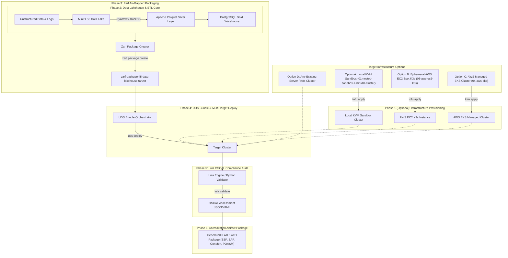

# Master Execution Plan: Air-Gapped IL4/IL5 Data Lakehouse (Zarf + UDS + Lula)

This document outlines the **6-Phase Implementation Plan** for building, deploying, and auditing an air-gapped Data Lakehouse and automated IL4/IL5 accreditation engine.

> 💡 **Infrastructure Agnostic Multi-Target Design:** Phase 1 (Terraform Provisioning) is **optional**. Anyone with an existing server or Kubernetes cluster (K3s, RKE2, EKS, KinD, bare-metal) can skip Phase 1 and deploy directly starting at Phase 2/3.
> 
> Four infrastructure targets are supported:
> * **Option A:** Local KVM Nested Sandbox VM (`01-nested-sandbox` & `02-k8s-cluster`)
> * **Option B:** Ephemeral AWS EC2 Spot + K3s Sandbox (`03-aws-ec2-k3s`)
> * **Option C:** Production-Fidelity AWS Managed EKS (`04-aws-eks`)
> * **Option D:** Bring Your Own Server / Kubernetes Cluster

> ⚠️ **Verification Gate Requirement:** After completing each phase, you MUST execute the **Gate Verification Commands** and confirm green status before advancing to the next phase.

---

## 📅 Phase Summary Roadmap



---

## 🚩 Phase 1 (Optional): Multi-Target Infrastructure Provisioning via Terraform / OpenTofu

### Objective
Provide automated infrastructure provisioning for local virtualization and cloud sandboxes.

*(Skip Phase 1 if deploying to an existing server or Kubernetes cluster).*

### Target Options & Tasks

#### Option A: Local KVM Sandbox (`libvirt` / KVM)
- [x] Configure Stage 1: `terraform/environments/01-nested-sandbox` referencing module `nested_sandbox_vm`.
- [x] Generate deterministic ED25519 host key using `tls_private_key.sandbox_host_key` and populate `.terraform/known_hosts`.
- [x] Inject host keys into `cloud_init.cfg` under `ssh_keys:` (`ed25519_private` & `ed25519_public`).
- [x] Configure Stage 2: `terraform/environments/02-k8s-cluster` referencing module `k8s_cluster_nodes` targeting the Layer 1 Sandbox VM.
- [x] Automate lifecycle commands (`make dev-sandbox`, `make dev-cluster`, `make dev-destroy-all`).

#### Option B: Ephemeral AWS EC2 Spot + K3s (`03-aws-ec2-k3s`)
- [x] Configure `terraform/environments/03-aws-ec2-k3s` with Spot instance provisioning (~$0.04/hr).
- [x] Automate K3s installation and remote kubeconfig extraction via `scripts/fetch_aws_kubeconfig.sh k3s`.
- [x] Provide Makefile targets `make aws-k3s-up` and `make aws-k3s-down`.

#### Option C: Production-Fidelity AWS Managed EKS (`04-aws-eks`)
- [x] Configure `terraform/environments/04-aws-eks` with EKS 1.30+ and Amazon Linux 2023 (`AL2023_x86_64_STANDARD`) managed node group.
- [x] Configure AWS EBS CSI Driver add-on with IAM Role Policy Attachment (`AmazonEBSCSIDriverPolicy`).
- [x] Automate default `gp3` StorageClass provisioning and kubeconfig extraction via `scripts/fetch_aws_kubeconfig.sh eks`.
- [x] Provide Makefile targets `make aws-eks-up` and `make aws-eks-down`.

### 🔍 Gate Verification Commands (Phase 1)
```bash
# 1. Run Pre-flight Doctor
make doctor

# 2. Verify Local KVM Sandbox VM
make verify-phase1

# 3. Verify AWS K3s or EKS cluster nodes
kubectl get nodes -o wide
```

---

## 🚩 Phase 2: Data Lakehouse & ETL Application Core

### Objective
Build the Data Lakehouse application components (MinIO S3 for unstructured data, Apache Parquet converter, DuckDB/PostgreSQL for warehousing analytics).

### Tasks
- [x] Create `src/lakehouse_etl.py` script handling raw unstructured JSON/logs -> Bronze S3 bucket.
- [x] Implement PyArrow / DuckDB transformation to columnar Parquet -> Silver S3 bucket.
- [x] Implement Gold layer analytical summary table inside PostgreSQL.
- [x] Create Kubernetes Helm chart in `k8s/charts/datalakehouse`.
- [x] Add automated unit tests in `tests/test_lakehouse_etl.py` and `tests/test_helm_chart.py`.

### 🔍 Gate Verification Commands (Phase 2)
```bash
# Run unit test suite
python3 -m unittest discover tests
```
**Success Criteria:** ETL script completes without error, Parquet files are generated in S3, SQL warehouse queries return aggregate results, and Helm chart lints cleanly.

---

## 🚩 Phase 3: Zarf Air-Gapped Packaging

### Objective
Bundle all container images, manifests, and scripts into a single immutable `.tar.zst` Zarf package capable of deploying into zero-trust, disconnected environments.

### Tasks
- [x] Draft `zarf.yaml` with package `il5-data-lakehouse` and component `datalakehouse-core` deploying local Helm chart and manifests.
- [x] Include all required OCI container images with pinned immutable tags (`quay.io/minio/minio:RELEASE.2024-01-16T16-07-38Z`, `postgres:15-alpine`, `python:3.11-slim`).
- [x] Create configuration and automated test verification suites (`zarf-config.yaml`, `tests/test_zarf_package.py`, `scripts/verify_phase3.py`).
- [x] Test air-gapped creation (`make package` / `zarf package create --confirm`).

### 🔍 Gate Verification Commands (Phase 3)
```bash
# 1. Run automated Phase 3 verification
make verify-phase3

# 2. Inspect generated Zarf package metadata & SBOM
zarf package inspect $(ls -t zarf-package-*.tar.zst 2>/dev/null | head -n 1)
```
**Success Criteria:** `zarf package create` succeeds, generating a valid `.tar.zst` package with complete Software Bill of Materials (SBOM).

---

## 🚩 Phase 4: UDS Bundle Orchestration & Multi-Target Deployment

### Objective
Orchestrate the Zarf package using **UDS (Unicorn Delivery System)** alongside UDS Core (Istio mTLS service mesh, Keycloak SSO, and Pepr policies) across local and cloud environments.

### Tasks
- [x] Create `uds-bundle.yaml` referencing the local Zarf package `il5-data-lakehouse` with 3-tier component value overrides.
- [x] Implement Istio STRICT mTLS (`k8s/mesh/peer-authentication.yaml`) and Zero-Trust ingress (`k8s/mesh/authorization-policy.yaml`).
- [x] Define parameterized runtime configuration overlays:
  - `uds-config.yaml` (default / local-path)
  - `uds-config-aws-k3s.yaml` (AWS EC2 K3s)
  - `uds-config-aws-eks.yaml` (AWS Managed EKS with gp3 storage)
- [x] Create automated Phase 4 unit tests (`tests/test_uds_bundle.py`) and verification gate (`scripts/verify_phase4.py`).
- [x] Create multi-target deployment targets (`make bundle-deploy-aws-k3s`, `make bundle-deploy-aws-eks`).

### 🔍 Gate Verification Commands (Phase 4)
```bash
# 1. Run automated Phase 4 verification
make verify-phase4

# 2. Check all deployed pods in cluster
kubectl get pods -n datalakehouse

# 3. Verify Istio mTLS Policy Enforcement
kubectl get peerauthentication,authorizationpolicy -n datalakehouse
```
**Success Criteria:** All K8s pods transition to `Running` state, Istio mTLS is enforced in `STRICT` mode, and service endpoints respond cleanly.

---

## 🚩 Phase 5: Lula OSCAL Continuous Compliance Audit

### Objective
Define DoD IL4/IL5 security controls in OSCAL format (`oscal-il5.yaml`) and run continuous compliance validation against the live cluster state using Lula, with zero-dependency Python validator and Go exporter fallbacks.

### Tasks
- [x] Write `oscal-il5.yaml` covering NIST SP 800-53 Rev 5 controls (AC-3, AC-6, IA-2, SC-8, SC-13, SI-2, AU-2).
- [x] Implement native Python evaluator (`scripts/validate_compliance.py`) with automatic Lula CLI delegation.
- [x] Implement Go compliance exporter (`src/compliance_exporter/main.go`) and Python fallback (`scripts/compliance_exporter.py`).
- [x] Create automated Phase 5 verification gate (`scripts/verify_phase5.py`).

### 🔍 Gate Verification Commands (Phase 5)
```bash
# Run Lula OSCAL continuous compliance evaluation
make audit
```
**Success Criteria:** `make audit` executes successfully and exporter returns 100% passing status across all defined IL4/IL5 controls.

---

## 🚩 Phase 6: Automated Accreditation Artifact Generation (ATO Package)

### Objective
Transform machine-readable OSCAL assessment results into human-readable System Security Plan (SSP), Security Assessment Report (SAR), Continuous Monitoring Plan (ConMon), and Plan of Action and Milestones (POA&M) markdown documentation.

### Tasks
- [x] Author comprehensive SSP template (`docs/accreditation/01_System_Security_Plan_SSP.md`).
- [x] Write automated ATO package generator (`scripts/generate_ato_package.py`).
- [x] Export complete IL4/IL5 accreditation artifact package into `docs/accreditation/`.
- [x] Create automated Phase 6 verification gate (`scripts/verify_phase6.py`).

### 🔍 Gate Verification Commands (Phase 6)
```bash
# 1. Generate full ATO package
make ato-package

# 2. Verify all accreditation documents
make verify-phase6
```
**Success Criteria:** Complete, audit-ready IL4/IL5 ATO package generated in `docs/accreditation/` with 100% verified control coverage.
