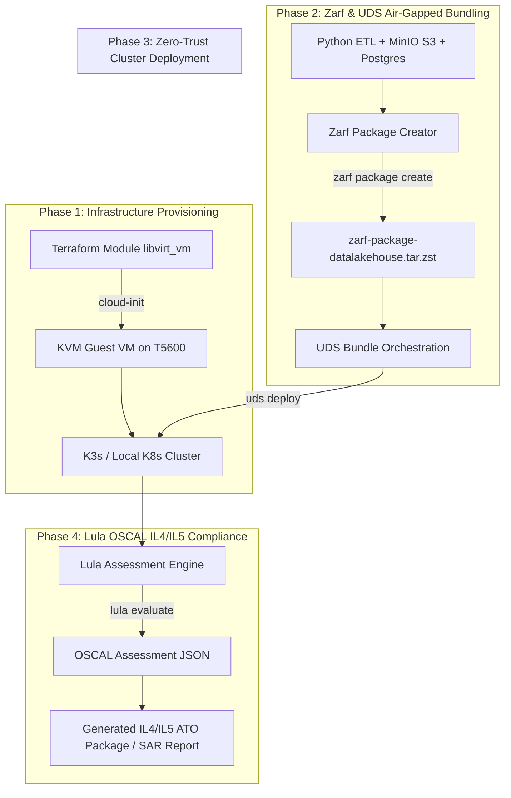

# Air-Gapped IL4/IL5 Accredited Data Lakehouse (Zarf + UDS + Lula)

An enterprise-grade reference architecture for delivering an **Air-Gapped Data Lakehouse** (MinIO S3 + Apache Parquet + DuckDB/PostgreSQL) with continuous **DoD IL4 / IL5 Accreditation Artifact Generation** using **Zarf**, **UDS (Unicorn Delivery System)**, and **Lula (OSCAL Compliance-as-Code)**.

Provisioned on local hypervisor infrastructure via **Terraform** (`dmacvicar/libvirt` provider) using **HashiCorp Standard Module Structure** and `cloud-init`.

---

## 🏗️ Architecture Overview



---

## 📚 Documentation Index

| File | Description |
| :--- | :--- |
| 📋 **[PLAN.md](PLAN.md)** | Step-by-step phased execution roadmap with explicit verification checkpoints at every phase. |
| 🛠️ **[DEVELOPMENT.md](DEVELOPMENT.md)** | Tool prerequisites, environment variable configuration, and developer workflow commands. |
| 📑 **[docs/adr/](docs/adr/)** | Architecture Decision Records capturing design choices, trade-offs, and rationale. |

---

## 🚀 Quick Start Summary

```bash
# 1. Inspect the Master Plan
cat PLAN.md

# 2. Provision Dev VM Infrastructure via Terraform
cd terraform/environments/dev
cp terraform.tfvars.example terraform.tfvars
terraform init
terraform apply

# 3. Verify VM Connectivity & K8s Cluster
ssh brian@<vm-ip> 'kubectl get nodes'
```

For full setup instructions, follow **[DEVELOPMENT.md](DEVELOPMENT.md)**.
