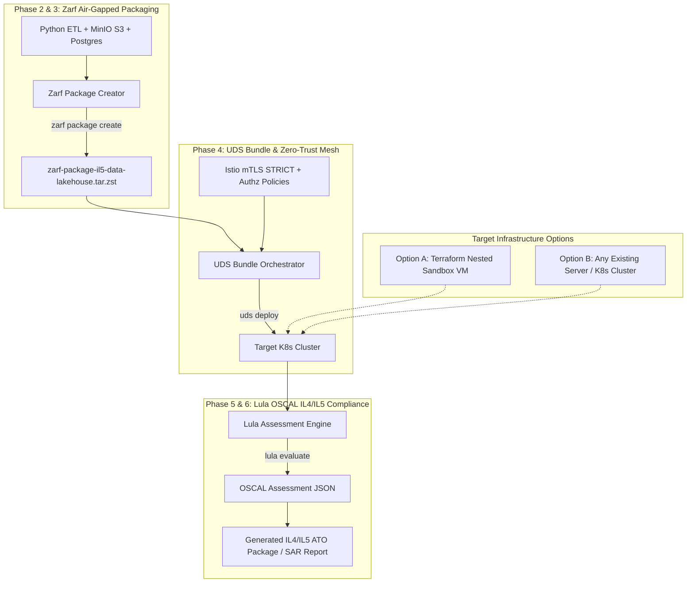

# Air-Gapped IL4/IL5 Accredited Data Lakehouse (Zarf + UDS + Lula)

An enterprise-grade reference architecture for delivering an **Air-Gapped Data Lakehouse** (MinIO S3 + Apache Parquet + DuckDB/PostgreSQL) with continuous **DoD IL4 / IL5 Accreditation Artifact Generation** using **Zarf**, **UDS (Unicorn Delivery System)**, and **Lula (OSCAL Compliance-as-Code)**.

> 💡 **Infrastructure Agnostic Design:** 
> * **Option A (Included Terraform Setup):** Automate the creation of a nested KVM VM hypervisor sandbox on your host server (`192.168.9.110`) using Terraform (`01-nested-sandbox` & `02-k8s-cluster`).
> * **Option B (Bring Your Own Server / Cluster):** Have an existing server, bare-metal node, AWS EC2 instance, or K3s/KinD cluster? **Skip Terraform entirely!** Point your `KUBECONFIG` to your cluster and deploy the Zarf package and UDS bundle directly.

---

## 🏗️ Architecture Overview



---

## 📚 Documentation Index

| File | Description |
| :--- | :--- |
| 📋 **[PLAN.md](PLAN.md)** | Step-by-step 6-phase execution roadmap with explicit verification checkpoints at every phase. |
| 🛠️ **[DEVELOPMENT.md](DEVELOPMENT.md)** | Tool prerequisites, environment variable configuration, and developer workflow commands. |
| 📑 **[docs/adr/](docs/adr/)** | Architecture Decision Records capturing design choices, trade-offs, and rationale. |
| 📊 **[docs/artifacts/](docs/artifacts/)** | Automated phase verification reports and audit artifacts. |

---

## 🚀 Quick Start Summary

### Option A: Provision Local Dev VM Infrastructure via Terraform
```bash
# 1. Provision Stage 1 Nested Sandbox VM (192.168.9.110)
cd terraform/environments/01-nested-sandbox
cp terraform.tfvars.example terraform.tfvars
terraform init && terraform apply

# 2. Provision Stage 2 K8s Cluster Nodes inside Sandbox VM
cd ../02-k8s-cluster
cp terraform.tfvars.example terraform.tfvars
terraform init && terraform apply
```

### Option B: Deploy to Any Existing Server or Cluster
```bash
# 1. Export your existing cluster kubeconfig
export KUBECONFIG=~/.kube/config

# 2. Build Zarf Air-Gapped Package (Phase 3)
make package

# 3. Create & Deploy UDS Bundle with Istio STRICT mTLS (Phase 4)
make bundle-create
make bundle-deploy

# 4. Verify Phase 4 Health & Security Baseline
make verify-phase4

# 5. Evaluate DoD IL4/IL5 Compliance (Phase 5)
make audit
```

For full setup instructions, follow **[DEVELOPMENT.md](DEVELOPMENT.md)**.
