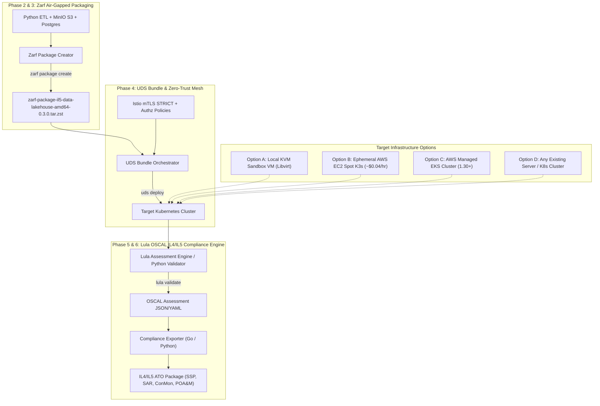

# Air-Gapped IL4/IL5 Accredited Data Lakehouse (Zarf + UDS + Lula)

An enterprise-grade reference architecture for delivering an **Air-Gapped Data Lakehouse** (MinIO S3 + Apache Parquet + DuckDB/PostgreSQL) with continuous **DoD IL4 / IL5 Accreditation Artifact Generation** using **Zarf**, **UDS (Unicorn Delivery System)**, and **Lula (OSCAL Compliance-as-Code)**.

> 💡 **Infrastructure Agnostic Multi-Target Design:**
> * **Option A (Local KVM Sandbox):** Automated two-tier libvirt/KVM nested hypervisor sandbox (`01-nested-sandbox` & `02-k8s-cluster`).
> * **Option B (AWS EC2 Spot K3s):** Ultra low-cost (~$0.04/hr) cloud sandbox with automated kubeconfig fetching (`make aws-k3s-up`).
> * **Option C (AWS Managed EKS):** Production-fidelity AWS EKS cluster (K8s 1.30+) with AL2023 nodes and automated EBS CSI `gp3` storage (`make aws-eks-up`).
> * **Option D (Bring Your Own Cluster):** Point your `KUBECONFIG` to any existing cluster (KinD, RKE2, OpenShift, bare-metal) and deploy directly without Terraform.

---

## 🏗️ Architecture Overview



---

## 🩺 Pre-Flight Diagnostics (`make doctor`)

Before provisioning or deploying, run the built-in diagnostic tool to inspect host toolchains, AWS authentication, local Zarf cache, and cross-file declarative schema parity:

```bash
make doctor
# or: python3 scripts/doctor.py
```

The doctor validates:
* **Toolchain Availability:** `python3`, `tofu`/`terraform`, `kubectl`, `zarf`, `uds`, `go`, `lula` (with zero-dependency fallback warnings).
* **AWS Cloud Authentication:** STS caller identity and account verification status.
* **Declarative Schema Parity:** Package name alignment across `zarf.yaml` and `uds-bundle.yaml`, UDS config variable scopes, local package path declarations, and container image immutability.

---

## 🚀 Quick Start Workflows

### 1. Build Air-Gapped Artifacts (Phase 3 & 4)
```bash
# Build Zarf air-gapped package (.tar.zst) with Syft SBOMs
make package

# Create UDS Bundle archive (.tar.zst)
make bundle-create
```

### 2. Choose Deployment Target

#### Option A: Local KVM Sandbox VM
```bash
make dev-sandbox    # Provision Stage 1 Layer 1 Nested Hypervisor VM
make dev-cluster    # Provision Stage 2 K8s Cluster Node inside Sandbox
make bundle-deploy  # Deploy UDS Bundle
```

#### Option B: Ephemeral AWS EC2 Spot + K3s (~$0.04/hr)
```bash
make aws-k3s-up              # Provision EC2 instance & configure kubeconfig
make bundle-deploy-aws-k3s   # Deploy bundle with K3s local-path storage overlay
make audit                   # Run IL4/IL5 compliance audit
make aws-k3s-down            # Tear down immediately after testing
```

#### Option C: Production-Fidelity AWS Managed EKS
```bash
make aws-eks-up              # Provision EKS 1.30+ cluster & configure gp3 storage
make bundle-deploy-aws-eks   # Deploy bundle with AWS gp3 storage overlay
make audit                   # Run IL4/IL5 compliance audit
make aws-eks-down            # Destroy EKS cluster & avoid control plane fees
```

#### Option D: Bring Your Own Cluster
```bash
export KUBECONFIG=/path/to/target/kubeconfig
make zarf-init       # Initialize Zarf internal registry in cluster
make bundle-deploy   # Deploy UDS Bundle
```

### 3. Run Compliance Audit & Generate ATO Package (Phase 5 & 6)
```bash
# Run continuous OSCAL compliance audit
make audit

# Generate complete DoD IL5 ATO Documentation Package
make ato-package
```

---

## 📚 Documentation Index

| Resource | Description |
| :--- | :--- |
| 📋 **[PLAN.md](PLAN.md)** | Comprehensive 6-phase master execution plan with verification checkpoints. |
| 🛠️ **[DEVELOPMENT.md](DEVELOPMENT.md)** | Tool prerequisites, environment variable configuration, and developer workflow commands. |
| 🛡️ **[docs/accreditation/](docs/accreditation/)** | DoD IL5 Authorization to Operate (ATO) artifact package (SSP, SAR, ConMon, POA&M). |
| 📊 **[docs/artifacts/](docs/artifacts/)** | Phase gate execution reports and verification artifacts. |

---

## 📑 Architecture Decision Records (ADRs)

Key architectural and technical decisions are captured in `docs/adr/`:

| ADR | Title | Status |
| :--- | :--- | :--- |
| **[ADR 0001](docs/adr/0001-record-architecture-decisions.md)** | Record Architecture Decisions | Accepted |
| **[ADR 0002](docs/adr/0002-infrastructure-provisioning-via-terraform-libvirt.md)** | Infrastructure Provisioning via Terraform & Libvirt | Accepted |
| **[ADR 0003](docs/adr/0003-data-lakehouse-and-oscal-compliance-stack.md)** | Data Lakehouse & OSCAL Compliance Stack | Accepted |
| **[ADR 0004](docs/adr/0004-terraform-hashicorp-standard-module-structure.md)** | Terraform Standard Module Structure | Accepted |
| **[ADR 0005](docs/adr/0005-helm-packaging-and-golang-exporter.md)** | Helm Packaging & Golang Compliance Exporter | Accepted |
| **[ADR 0006](docs/adr/0006-nested-sandbox-hypervisor-and-ssh-host-keys.md)** | Nested Sandbox Hypervisor & SSH Host Keys | Accepted |
| **[ADR 0007](docs/adr/0007-decoupled-infrastructure-agnostic-delivery.md)** | Decoupled Infrastructure-Agnostic Delivery | Accepted |
| **[ADR 0008](docs/adr/0008-zarf-air-gapped-packaging.md)** | Zarf Air-Gapped Packaging Architecture | Accepted |
| **[ADR 0009](docs/adr/0009-uds-bundle-orchestration-and-service-mesh.md)** | UDS Bundle Orchestration & Service Mesh Security | Accepted |
| **[ADR 0010](docs/adr/0010-lula-oscal-automated-compliance-evaluation.md)** | Lula OSCAL Automated Compliance Evaluation | Accepted |
| **[ADR 0011](docs/adr/0011-automated-accreditation-artifact-generation.md)** | Automated Accreditation Artifact Generation | Accepted |
| **[ADR 0012](docs/adr/0012-aws-cloud-deployment-targets.md)** | AWS Cloud Deployment Targets (EC2 K3s & Managed EKS) | Accepted |
| **[ADR 0013](docs/adr/0013-automated-preflight-diagnostics-and-schema-parity-guardrails.md)** | Automated Preflight Diagnostics & Schema Parity Guardrails | Accepted |
