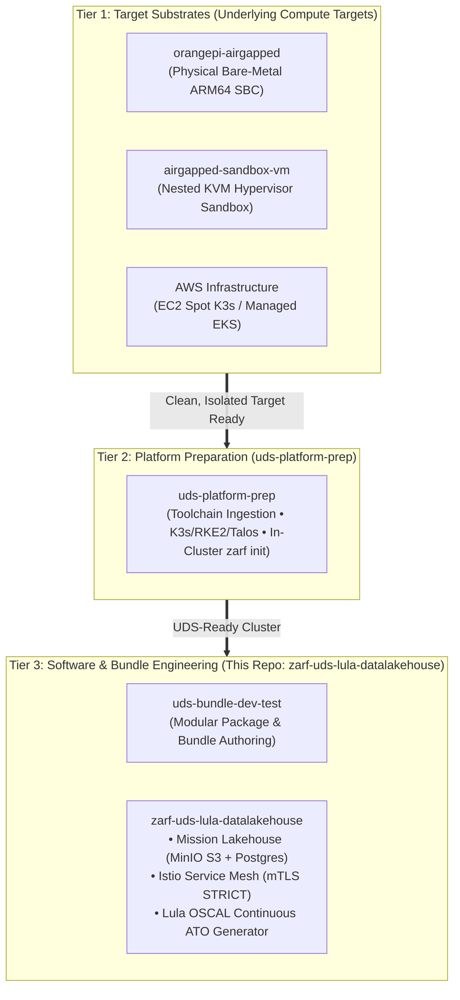
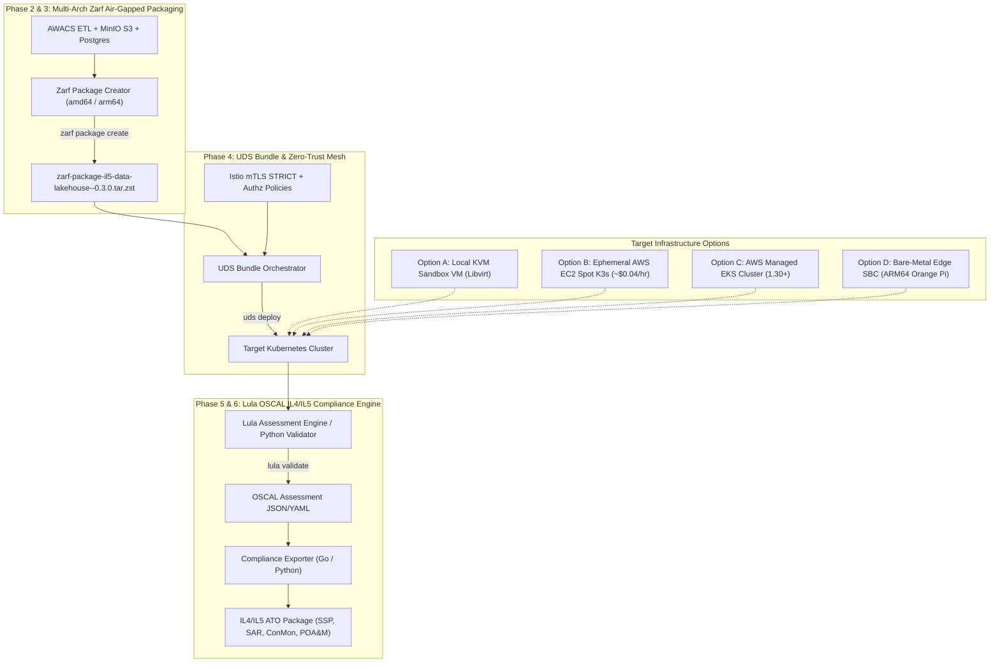

# Air-Gapped IL4/IL5 Accredited Data Lakehouse (`zarf-uds-lula-datalakehouse`)

[](PLAN.md)
[](DEVELOPMENT.md)
[](LICENSE)

A hands-on demonstration and learning project created to explore and master the **Defense Unicorns toolchain (Zarf, UDS, Lula)** by building a realistic, compliant mission workload from the ground up.

Rather than deploying a toy application, I built an end-to-end **Medallion Data Lakehouse** (MinIO S3 + PostgreSQL + Apache Parquet) to demonstrate practical understanding of what it takes to engineer a system that satisfies **DoD Impact Level 5 (IL5)** and **NIST SP 800-53 Rev 5** requirements in disconnected defense environments:

1. **Air-Gap Delivery (Zarf):** Packaging multi-tier data services, ETL pipelines, and Syft SBOMs into self-contained, immutable `.tar.zst` artifacts.
2. **Zero-Trust Network Architecture (UDS Core & Istio):** Enforcing cryptographic pod-to-pod isolation, `STRICT` mutual TLS, and explicit `AuthorizationPolicies` across data lakehouse tiers.
3. **Continuous Compliance as Code (Lula & OSCAL):** Writing declarative OSCAL v1.1.2 assessment models to continuously audit live Kubernetes state against security controls (AC-3, AC-4, IA-2, SC-8, SC-28, CM-8).
4. **Automated ATO Package Generation:** Using custom Python and Go compliance exporters to transform live Lula assessment results into audit-ready DoD IL5 Authorization to Operate (ATO) documentation (SSP, SAR, Continuous Monitoring Plan, and POA&M).

> [!WARNING]
> ### ⚠️ Project Maturity: Alpha Reference Architecture
> This repository is an **experimental proof-of-concept and learning laboratory** under active alpha development.
> * **Testing Notice:** Automated unit tests and static schema checks are in place, but full multi-cloud automated regression suites and extensive failure-mode testing are currently minimal.
> * **Production Use:** Not certified for mission-critical or live production workloads without independent security verification, vulnerability scanning, and formal accreditation review.

> 💡 **Infrastructure Agnostic Multi-Target Design:**
> * **Option A (Local KVM Sandbox):** Automated two-tier libvirt/KVM nested hypervisor sandbox (`01-nested-sandbox` & `02-k8s-cluster`).
> * **Option B (AWS EC2 Spot K3s):** Ultra low-cost (~$0.04/hr) cloud sandbox with automated kubeconfig fetching (`make aws-k3s-up`).
> * **Option C (AWS Managed EKS):** Production-fidelity AWS EKS cluster (K8s 1.30+) with AL2023 nodes and automated EBS CSI `gp3` storage (`make aws-eks-up`).
> * **Option D (Bring Your Own Cluster):** Point your `KUBECONFIG` to any existing cluster (KinD, RKE2, OpenShift, bare-metal).
> * **Option E (Tactical Bare-Metal Edge / ARM64):** Deploy directly to disconnected ARM64 single-board computers (Orange Pi 5 Pro / RK3588S, Raspberry Pi 5) with multi-arch OCI images and embedded AWACS track correlation (`make bundle-deploy` + `make mission-status`).

---

## Where this fits in the 3-Tier Architecture

This repository represents **Tier 3: Software, Bundle Engineering & Mission Workload**. It is the demonstration application deployed onto a target cluster that has been prepared by **Tier 2** ([`uds-platform-prep`](https://github.com/celttechie/uds-platform-prep)) on top of **Tier 1** infrastructure (whether local Libvirt KVM sandboxes, ephemeral AWS EC2 Spot K3s, AWS Managed EKS, or bare-metal edge nodes).


```mermaid
flowchart TD
    subgraph T1 ["Tier 1: Target Substrates (Underlying Compute Targets)"]
        direction LR
        OPI["orangepi-airgapped\n(Physical Bare-Metal ARM64 SBC)"]
        KVM["airgapped-sandbox-vm\n(Nested KVM Hypervisor Sandbox)"]
        AWS["AWS Infrastructure\n(EC2 Spot K3s / Managed EKS)"]
    end

    subgraph T2 ["Tier 2: Platform Preparation (uds-platform-prep)"]
        direction LR
        PREP["uds-platform-prep\n(Toolchain Ingestion • K3s/RKE2/Talos • In-Cluster zarf init)"]
    end

    subgraph T3 ["Tier 3: Software & Bundle Engineering (This Repo: zarf-uds-lula-datalakehouse)"]
        direction LR
        DEV["uds-bundle-dev-test\n(Modular Package & Bundle Authoring)"]
        LAKE["zarf-uds-lula-datalakehouse\n• Mission Lakehouse (MinIO S3 + Postgres)\n• Istio Service Mesh (mTLS STRICT)\n• Lula OSCAL Continuous ATO Generator"]
    end

    T1 ==>|"Clean, Isolated Target Ready"| T2
    T2 ==>|"UDS-Ready Cluster"| T3
```

---

## 🏗️ Architecture Overview


```mermaid
flowchart TD
    subgraph TargetEnv ["Target Infrastructure Options"]
        OPT_A["Option A: Local KVM Sandbox VM (Libvirt)"]
        OPT_B["Option B: Ephemeral AWS EC2 Spot K3s (~$0.04/hr)"]
        OPT_C["Option C: AWS Managed EKS Cluster (1.30+)"]
        OPT_D["Option D: Bare-Metal Edge SBC (ARM64 Orange Pi)"]
    end

    subgraph Packaging ["Phase 2 & 3: Multi-Arch Zarf Air-Gapped Packaging"]
        APP["AWACS ETL + MinIO S3 + Postgres"] --> ZARF["Zarf Package Creator (amd64 / arm64)"]
        ZARF -->|"zarf package create"| TAR["zarf-package-il5-data-lakehouse-<arch>-0.3.0.tar.zst"]
    end

    subgraph Orchestration ["Phase 4: UDS Bundle & Zero-Trust Mesh"]
        TAR --> UDS["UDS Bundle Orchestrator"]
        MESH["Istio mTLS STRICT + Authz Policies"] --> UDS
        UDS -->|"uds deploy"| K8S["Target Kubernetes Cluster"]
        OPT_A -.-> K8S
        OPT_B -.-> K8S
        OPT_C -.-> K8S
        OPT_D -.-> K8S
    end

    subgraph Accreditation ["Phase 5 & 6: Lula OSCAL IL4/IL5 Compliance Engine"]
        K8S --> LULA["Lula Assessment Engine / Python Validator"]
        LULA -->|"lula validate"| OSCAL["OSCAL Assessment JSON/YAML"]
        OSCAL --> EXP["Compliance Exporter (Go / Python)"]
        EXP --> ATO["IL4/IL5 ATO Package (SSP, SAR, ConMon, POA&M)"]
    end
```

---

## 🏁 Getting Started (First 5 Minutes)

### Step 1: Clone & Run Pre-Flight Diagnostics
Clone the repository and run `make doctor` to inspect your local environment:
```bash
git clone https://github.com/celttechie/zarf-uds-lula-datalakehouse.git
cd zarf-uds-lula-datalakehouse
make doctor
```
> 💡 **Self-Healing Diagnostics:** `make doctor` verifies your installed CLIs (`python3`, `tofu`/`terraform`, `kubectl`, `zarf`, `uds`, `lula`, `go`, AWS CLI) and prints exact copy-paste installation commands for any missing tools.

### Step 2: Instant Local Validation (No Cluster or Cloud Needed)
Test the data transformations and generate the complete DoD IL5 ATO compliance documentation package locally:
```bash
# Run 28 automated unit tests and simulate the Medallion ETL pipeline
make test

# Generate the 4-document DoD IL5 ATO package in docs/accreditation/
make ato-package
```

### Step 3: Build Air-Gapped Packaging Artifacts
Build the self-contained `.tar.zst` packages. Architecture is auto-detected from your host, or can be explicitly specified for cross-building edge packages:

```bash
# Standard Build (Host Architecture):
make package
make bundle-create

# Cross-Build for ARM64 Edge Targets (e.g. Orange Pi 5 Pro / Raspberry Pi 5):
make package ARCH=arm64
make bundle-create ARCH=arm64
```

### Step 4: Choose Your Deployment Target

#### Option A: Local KVM Sandbox VM (Libvirt)
```bash
make dev-sandbox    # Provision Stage 1 Layer 1 Nested Hypervisor VM
make dev-cluster    # Provision Stage 2 K8s Cluster Node inside Sandbox
make bundle-deploy  # Deploy UDS Bundle
```

#### Option B: Ephemeral AWS EC2 Spot + K3s (~$0.04/hr)
```bash
make aws-k3s-up              # Provision EC2 instance & configure kubeconfig
make bundle-deploy-aws-k3s   # Deploy bundle with K3s local-path storage overlay
make audit                   # Run IL4/IL5 compliance audit
make aws-k3s-down            # Tear down immediately after testing
```

#### Option C: Production-Fidelity AWS Managed EKS
```bash
make aws-eks-up              # Provision EKS 1.30+ cluster & configure gp3 storage
make bundle-deploy-aws-eks   # Deploy bundle with AWS gp3 storage overlay
make audit                   # Run IL4/IL5 compliance audit
make aws-eks-down            # Destroy EKS cluster & avoid control plane fees
```

#### Option D: Disconnected Bare-Metal Edge Node / SBC (ARM64 Orange Pi 5 Pro)
```bash
# 1. Point to your edge cluster
export KUBECONFIG=/path/to/edge-kubeconfig

# 2. Build ARM64 packages (if building from an x86_64 host)
make package ARCH=arm64
make bundle-create ARCH=arm64

# 3. Deploy UDS bundle to target ARM64 cluster
make bundle-deploy

# 4. View Tactical Edge Common Operating Picture & Node Diagnostics
make mission-status

# 5. Execute Lula Continuous Compliance Audit
make audit
```

#### Option E: Bring Your Own Cluster (KinD, RKE2, OpenShift)
```bash
export KUBECONFIG=/path/to/target/kubeconfig
make zarf-init       # Initialize Zarf internal registry in cluster
make bundle-deploy   # Deploy UDS Bundle
make audit           # Run IL4/IL5 compliance audit
```

---

## 🛰️ Tactical Edge Common Operating Picture & Mission Status

For deployed tactical edge SBC nodes (e.g. ARM64 Orange Pi 5 Pro), run `make mission-status` to inspect hardware topology, cluster nodes, lakehouse pods, fused AWACS tactical radar tracks, and DoD IL5 continuous compliance status in a single real-time console view:

```bash
make mission-status
```

```text
========================================================================================
 █████╗ ██╗    ██╗ █████╗  ██████╗███████╗    ██╗███████╗███████╗
██╔══██╗██║    ██║██╔══██╗██╔════╝██╔════╝    ██║██╔════╝██╔════╝
███████║██║ █╗ ██║███████║██║     ███████╗    ██║█████╗  █████╗  
██╔══██║██║███╗██║██╔══██║██║     ╚════██║    ██║██╔══╝  ██╔══╝  
██║  ██║╚███╔███╔╝██║  ██║╚██████╗███████║    ██║██║     ██║     
╚═╝  ╚═╝ ╚══╝╚══╝ ╚═╝  ╚═╝ ╚═════╝╚══════╝    ╚═╝╚═╝     ╚═╝     

   COMBAT IDENTIFICATION (CID) // TACTICAL AIR TRACK CORRELATION (ARM64)               
========================================================================================

[1] TACTICAL EDGE HARDWARE & SYSTEM TOPOLOGY
 • Node Architecture : aarch64 (ARMv8 64-Bit / Rockchip RK3588S - 8 Cores)
 • Kernel Version    : 6.1.172-vendor-rk35xx
 • OS Distribution   : Armbian_community 26.11.0-trunk.52 resolute
 • Memory & Storage  : 2.1Gi/15Gi RAM | 14G/229G (7% used)
 • Network Link      : 192.168.42.100/24 (Direct Air-Gapped Maintenance Link)
 • Air-Gap State     : ✔ ZERO OUTBOUND ROUTE (100% Disconnected / No Internet)

[2] AIR-GAPPED KUBERNETES CLUSTER (K3s RUNTIME)
NODE           ROLE   K8S_VERSION    STATUS
orangepi5pro   true   v1.30.4+k3s1   Ready

[3] DEPLOYED WORKLOADS & IN-CLUSTER REGISTRY (UDS BUNDLE)
NAMESPACE       POD                                       READY   STATUS      IMAGE
datalakehouse   datalakehouse-minio-6754d957bc-scglb      true    Running     cgr.dev/chainguard/minio:latest
datalakehouse   medallion-etl-job-jvtb2                   false   Succeeded   python:3.11-slim
datalakehouse   postgresql-84b9958445-bf77b               true    Running     postgres:15-alpine

[4] AWACS TACTICAL COMMON OPERATING PICTURE (FUSED RADAR TRACKS)
 track_id |   callsign    |    platform_type     |  iff_status   | alt_ft | mach | threat_level |  conf  
----------+---------------+----------------------+---------------+--------+------+--------------+--------
 TRK-0104 | VIPER-11      | F-35A Lightning II   | FRIENDLY      |  34500 | 1.45 | NOMINAL      | 99.8%
 TRK-0219 | SENTRY-01     | E-3G Sentry (AWACS)  | FRIENDLY (C2) |  31000 | 0.78 | AIRBORNE C2  | 100.0%
 TRK-0782 | UNKNOWN-GHOST | Fast-Mover (BVR)     | UNKNOWN       |  48000 | 2.10 | ELEVATED     | 94.2%
 TRK-0914 | REAPER-04     | MQ-9A Reaper         | FRIENDLY      |  22000 | 0.32 | ISR PATROL   | 99.1%
 TRK-1055 | STRATO-99     | KC-135R Stratotanker | FRIENDLY      |  26000 | 0.74 | REFUEL TRACK | 100.0%
(5 rows)

[5] CONTINUOUS COMPLIANCE (DoD IMPACT LEVEL 5 / NIST SP 800-53 REV 5)
 • Compliance Engine : Lula OSCAL Continuous Validator
 • Compliance Score  : 100.0% (7 / 7 Controls Satisfied)
 • Controls Verified : AC-3 (Non-Root), AC-4 (Flow), IA-2 (SPIFFE), SC-8 (TLS 1.3), SC-13, SC-28, SI-4
 • Authorization     : Continuous Authorization to Operate (cATO) Invariants Met
========================================================================================
```

---

## 📚 Documentation Index

| Resource | Description |
| :--- | :--- |
| 📋 **[PLAN.md](PLAN.md)** | Comprehensive 6-phase master execution plan with verification checkpoints. |
| 🛠️ **[DEVELOPMENT.md](DEVELOPMENT.md)** | Tool prerequisites, environment variable configuration, and developer workflow commands. |
| 🛡️ **[docs/accreditation/](docs/accreditation/)** | DoD IL5 Authorization to Operate (ATO) artifact package (SSP, SAR, ConMon, POA&M). |
| 📊 **[docs/artifacts/](docs/artifacts/)** | Phase gate execution reports and verification artifacts. |

---

## 📑 Architecture Decision Records (ADRs)

Key architectural and technical decisions are captured in `docs/adr/`:

| ADR | Title | Status |
| :--- | :--- | :--- |
| **[ADR 0001](docs/adr/0001-record-architecture-decisions.md)** | Record Architecture Decisions | Accepted |
| **[ADR 0002](docs/adr/0002-infrastructure-provisioning-via-terraform-libvirt.md)** | Infrastructure Provisioning via Terraform & Libvirt | Accepted |
| **[ADR 0003](docs/adr/0003-data-lakehouse-and-oscal-compliance-stack.md)** | Data Lakehouse & OSCAL Compliance Stack | Accepted |
| **[ADR 0004](docs/adr/0004-terraform-hashicorp-standard-module-structure.md)** | Terraform Standard Module Structure | Accepted |
| **[ADR 0005](docs/adr/0005-helm-packaging-and-golang-exporter.md)** | Helm Packaging & Golang Compliance Exporter | Accepted |
| **[ADR 0006](docs/adr/0006-nested-sandbox-hypervisor-and-ssh-host-keys.md)** | Nested Sandbox Hypervisor & SSH Host Keys | Accepted |
| **[ADR 0007](docs/adr/0007-decoupled-infrastructure-agnostic-delivery.md)** | Decoupled Infrastructure-Agnostic Delivery | Accepted |
| **[ADR 0008](docs/adr/0008-zarf-air-gapped-packaging.md)** | Zarf Air-Gapped Packaging Architecture | Accepted |
| **[ADR 0009](docs/adr/0009-uds-bundle-orchestration-and-service-mesh.md)** | UDS Bundle Orchestration & Service Mesh Security | Accepted |
| **[ADR 0010](docs/adr/0010-lula-oscal-automated-compliance-evaluation.md)** | Lula OSCAL Automated Compliance Evaluation | Accepted |
| **[ADR 0011](docs/adr/0011-automated-accreditation-artifact-generation.md)** | Automated Accreditation Artifact Generation | Accepted |
| **[ADR 0012](docs/adr/0012-aws-cloud-deployment-targets.md)** | AWS Cloud Deployment Targets (EC2 K3s & Managed EKS) | Accepted |
| **[ADR 0013](docs/adr/0013-automated-preflight-diagnostics-and-schema-parity-guardrails.md)** | Automated Preflight Diagnostics & Schema Parity Guardrails | Accepted |
